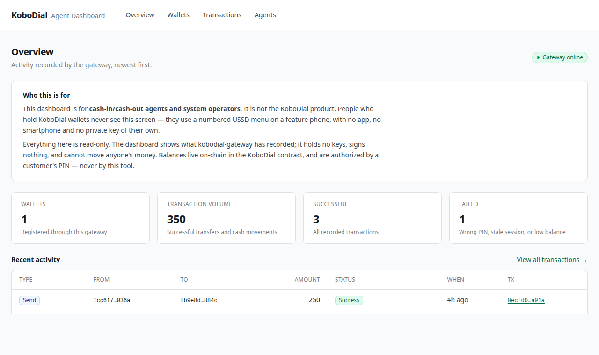
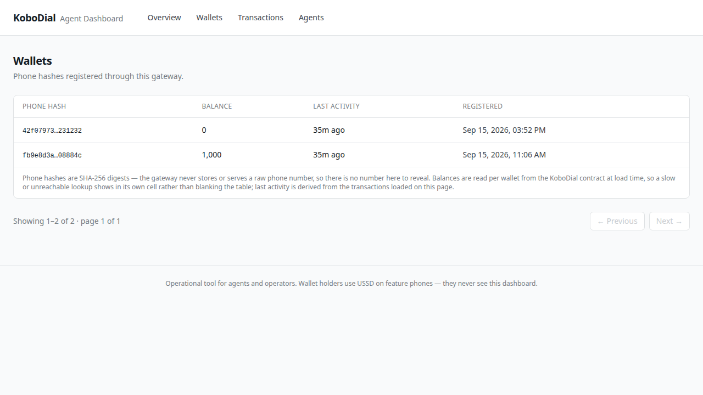
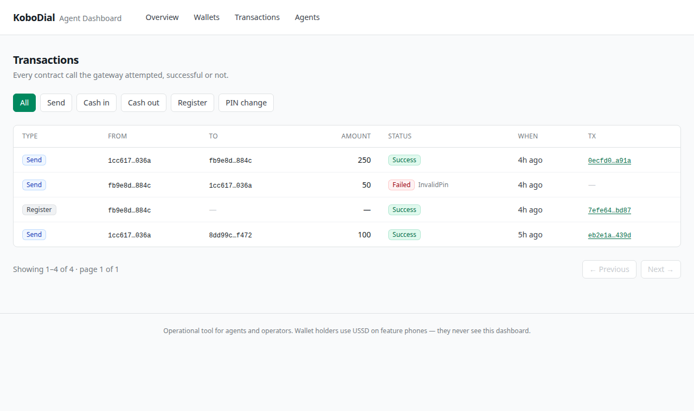
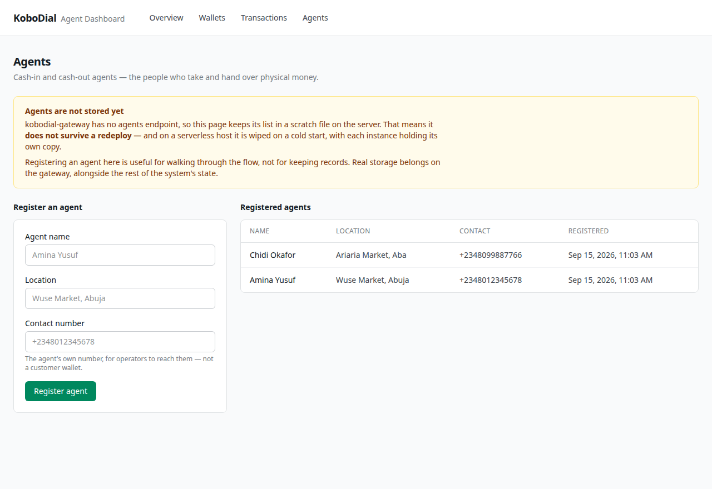
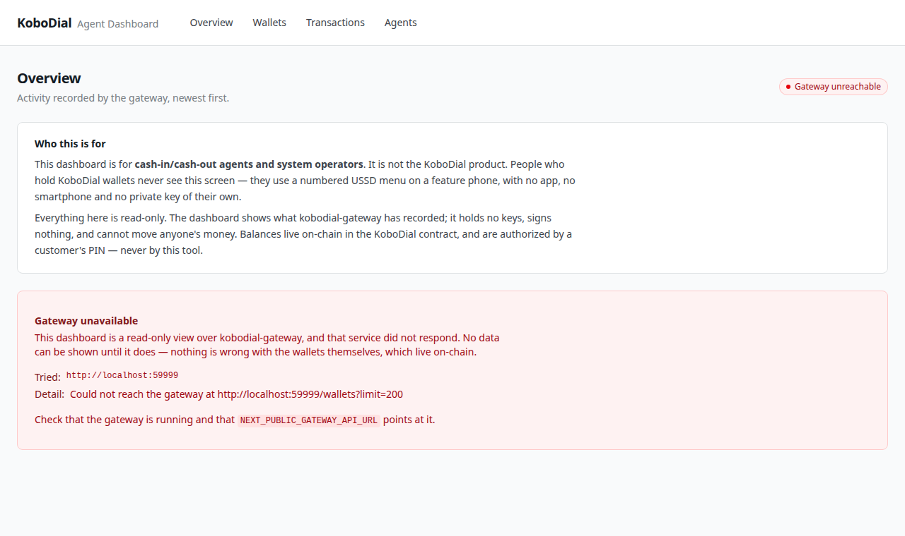

# kobodial-dashboard

The agent and operator dashboard for **KoboDial** — a phone-number-keyed
smart wallet on Stellar/Soroban, operated from feature phones over USSD.

Named for the **kobo**, the smallest unit of the Nigerian Naira.

> **This is not the KoboDial product.** People who hold KoboDial wallets
> never open this dashboard — they use a numbered USSD menu on a basic
> phone. This is the back office: cash-in/cash-out agents and system
> operators, watching what the system did.

**Live:** <https://kobodial-dashboard.vercel.app>



## The three repos

KoboDial is three services, each doing one job:

| Repo                                                               | What it is                                                                                               | Holds keys?           |
| ------------------------------------------------------------------ | -------------------------------------------------------------------------------------------------------- | --------------------- |
| [kobodial-contract](https://github.com/kobodial/kobodial-contract) | The Soroban smart contract. Wallets, balances, and the PIN + nonce checks that authorize every transfer. | —                     |
| [kobodial-gateway](https://github.com/kobodial/kobodial-gateway)   | The USSD gateway. Turns a feature-phone session into contract calls, and relays them.                    | Yes — the relayer key |
| **kobodial-dashboard** (this repo)                                 | Read-only operational view over the gateway's API.                                                       | No                    |

```
 Feature phone            Africa's Talking        kobodial-gateway         Soroban
      │                          │                       │                    │
      │  *384*1# → menus, PIN    │   POST /ussd          │  PIN + nonce       │
      ├─────────────────────────►├──────────────────────►├───────────────────►│
      │                          │                       │                    │
      │                          │                  records to SQLite         │
      │                          │                       │
      │                          │                       │  GET /wallets
      │                          │                       │  GET /transactions
      │                          │                       │  GET /health
      │                          │                       ▲
      │                          │                       │
      │                          │            kobodial-dashboard (this repo)
      │                          │            reads only — no keys, no chain
```

The distinction that matters: **this dashboard cannot move anyone's
money.** It holds no keys, signs nothing, and never talks to Soroban.
Every transfer is authorized on-chain by the customer's own PIN, checked
by the contract. An operator watching this screen is watching, not
approving.

## Pages

**Overview** — wallet count, transaction volume, success/failure counts,
recent activity, and a live gateway health badge.

**Wallets** — phone hashes registered through the gateway, each with its
on-chain balance and derived last-activity.



**Transactions** — every contract call the gateway attempted, successful
or not, filterable by type. Failures carry the contract's error variant,
because "failed" alone isn't actionable but `InvalidPin` tells an agent
the customer simply mistyped.



**Agents** — register and list cash-in/cash-out agents.



## One thing the UI is honest about

**Phone hashes are digests, not masked numbers.** The gateway never
stores a raw phone number — only a SHA-256 hash. This holds for agents
too: registering one sends the number to the gateway, which stores its
hash, so the tables show a truncated digest and no callable number.
Truncation is for legibility; there is no hidden number behind it.

Balances are read per wallet from the contract at load time. Each lookup
is its own round trip, so they are fetched with bounded concurrency and a
failed lookup shows in its own cell — "unavailable", or "not on-chain"
for a wallet the gateway indexed but the contract has no balance for —
rather than blanking the table.

## Setup

Requires Node 22 (see `.nvmrc`) and a running
[kobodial-gateway](https://github.com/kobodial/kobodial-gateway).

```sh
nvm use
npm install
cp .env.example .env.local
npm run dev
```

Point it at your gateway:

```sh
# .env.local
NEXT_PUBLIC_GATEWAY_API_URL=http://localhost:3000
```

Then open http://localhost:3000 — or whichever port Next reports, since
the gateway may already hold 3000.

You don't need a gateway to work on the UI. With it down, every page
renders its unavailable state, which is worth looking at while you
change it:



## How it fetches

Pages are server components, and all gateway calls happen on the server
(`lib/gateway.ts`). That's deliberate: the gateway sends no CORS
headers, so a browser fetching it cross-origin would simply be blocked.
Server rendering avoids that, and pages arrive with data already in the
HTML instead of after a spinner.

Paging and filters live in the URL, so a filtered view can be shared or
reloaded. One caveat stated on the page itself: the gateway's list
endpoints have no type filter, so filtering narrows the rows already
fetched rather than searching all history.

## Scripts

```sh
npm run dev         # development server
npm run build       # production build
npm start           # serve the build
npm run lint        # eslint + prettier --check
npm run typecheck   # tsc --noEmit
npm run format      # prettier --write
```

CI runs lint, typecheck and build on every push and PR. The build needs
no gateway — the same graceful-degradation that keeps the deployed app
from going blank.

## Deployment

Deployed on Vercel at <https://kobodial-dashboard.vercel.app>, which
runs as a standard Next.js project with no adapter or custom build step.

Any host that runs Next.js will do. The one setting that matters is
`NEXT_PUBLIC_GATEWAY_API_URL`: it must name a gateway the deployment can
actually reach over the public internet. A `localhost` value is the most
common way this comes up misconfigured — the hosted dashboard resolves
it to itself, finds nothing, and correctly reports the gateway as
unreachable.

## Out of scope for the MVP

Left out deliberately rather than half-built, and tracked so the reasoning
is readable rather than lost:

- [#4 Authentication](https://github.com/kobodial/kobodial-dashboard/issues/4)
  — the dashboard assumes trusted network access, which the gateway
  documents as its own posture too. Worth reading for why the current
  public deployment does not match that assumption.
- [#5 Agent commission calculations](https://github.com/kobodial/kobodial-dashboard/issues/5)
  — blocked on the gateway recording _which_ agent handled a transaction
  ([gateway#11](https://github.com/kobodial/kobodial-gateway/issues/11)),
  which it does not yet.

Resolved since the first release, once the gateway grew the endpoints they
needed: real agent storage (#2 → gateway#4), and server-side filtering and
paging (#3 → gateway#2, gateway#3). Balances (#1 → gateway#1) are shown too, read per wallet from the
contract.

## License

MIT — see [LICENSE](LICENSE).
